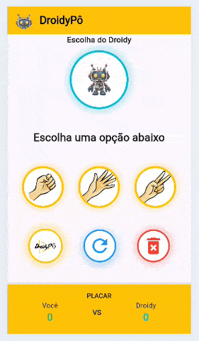

# 🤖 DroidyPô - Jokenpô Inteligente

O **DroidyPô** é um projeto desenvolvido em Flutter que eleva o clássico "Pedra, Papel e Tesoura" a um novo nível de interface de usuário. O foco principal foi o domínio de estados dinâmicos, lógica de jogo e estilização avançada de componentes.

## 📱 Demonstração

  
  
<i>Visualização das jogadas, animação de sombras reativas e placar dinâmico.</i>

---

## ✨ Funcionalidades

- **Lógica de Jogo Reativa:** IA que processa jogadas aleatórias e valida resultados (Vitória, Derrota ou Empate) em tempo real.
- **UI Baseada em Estados:** Mudanças visuais instantâneas nas bordas e sombras ao selecionar uma opção, utilizando o gerenciamento de estado do Flutter.
- **Controle de Sessão:** Placar acumulativo com funções integradas para "Nova Rodada" e "Reset Total" do placar.

## 🛠️ Tecnologias e Conceitos Aplicados

- **Custom Design (Glow Effect):** Uso avançado de `BoxShadow` com propriedades de `spreadRadius` e opacidade dinâmica para criar efeitos de brilho externo nos botões.
- **Recortes Precisos:** Implementação de `ClipOval` e `ClipRRect` combinados com `BoxFit.cover` para garantir que imagens de diferentes proporções fiquem perfeitamente circulares e padronizadas.
- **Layout Adaptativo:** Construção utilizando `SingleChildScrollView` e `MediaQuery` para garantir fluidez e evitar quebras de layout em diferentes tamanhos de tela.
- **Arquitetura de UI:** Modularização de estilos repetitivos em funções auxiliares (como a `_estiloBorda`), mantendo o código limpo, legível e de fácil manutenção.

## 🎨 Identidade Visual

O projeto utiliza uma paleta vibrante baseada em **Amber** (Amarelo), com cores de destaque estratégicas:
* **Cyan (Ciano):** Identidade visual do Droidy.
* **Green (Verde):** Feedback positivo para as ações do Jogador.
* **Red/Blue:** Cores funcionais para gerenciamento de placar e rodadas.

---

### 🛠️ Como executar o projeto

1. Certifique-se de ter o **Flutter SDK** instalado.
2. Clone o repositório.
3. Execute `flutter pub get` para instalar as dependências.
4. Rode o projeto com `flutter run`.